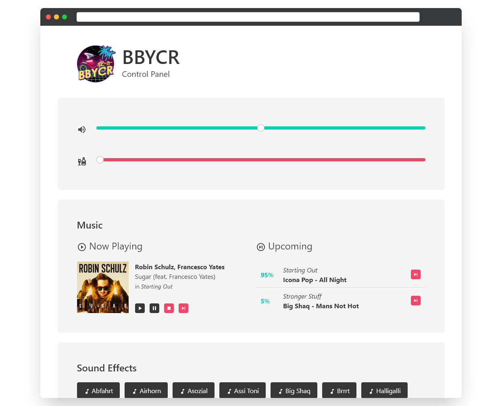
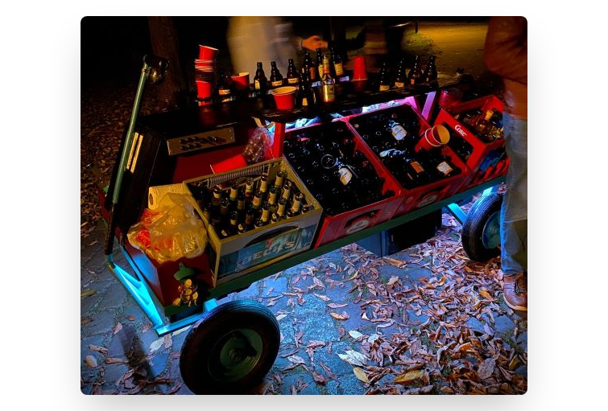

<!-- markdownlint-configure-file {
  "MD013": false,
  "MD033": false,
  "MD041": false
} -->

<div align="center">


# DEICHWAVE

[](https://github.com/dulli/deichwave/blob/master/LICENSE)
[](https://github.com/dulli/deichwave/releases/)
[](https://goreportcard.com/report/github.com/dulli/deichwave)

_Deichwave_ is an **automated**, but interactive, **media-player app** powering your parties with music :notes:, light- :rotating_light: and sound-effects :boom:.

Especially [on-the-go](#the-original-vehicle). :car:

---

[Getting started](#getting-started) •
[History](#background) •
[Development](#development)

---

</div>

## Getting Started

Copy the compiled executable as to your target computer and run it from the directory that contains your `data/sounds` and `data/music` folders (see [the `data` Readme](data/README.md)), e.g. using the command line:

```bash
./deichwave
```

Then monitor the log output to see if everything is up and running and for instructions to access [the web interface](#web-interface).

### Web Interface

By default, _Deichwave_ can be remote controlled using a web interface hosted at port `:3000`:

<div align="center">



<small>Screenshot of the web interface[^screenshots]</small>

</div>

[^screenshots]: [Screenshot created with `Screely`](https://www.screely.com/)

<!-- ### Setup -->

<!-- ### Configuration -->

## Background

The **BBYCR** is a [purpose-built vehicle](#the-original-vehicle) used for outdoor parties on the move (e.g. for [Kohltouren](https://en.wikipedia.org/wiki/Gr%C3%BCnkohlessen) or the traditional hiking tour on [German Father's Days](https://en.m.wikipedia.org/wiki/Father%27s_Day#Germany)). It is equipped with speakers to play music (continously, without requiring interaction while also being able to easily adjust what playlists are used) and sound effects (on demand), as well as being lit up with addressable LED strips (in addition to providing a way to bring along sufficient amounts of beer). It uses a `Raspberry Pi 3` as its on-board computer.

To power all this on a software level, _Deichwave_ was born after multiple previous attempts that simple bolted together a bunch of Python scripts with existing software like `MPD`, `pigpio` and others. As this proved to be too difficult to setup (and use for non-technical friends that borrowed the vehicle) and also not robust enough to survive the, sometimes day-long, deployments, it was first turned into multiple `Go` microservices that were again bolted onto the existing scripts and external software before being rewritten into its current form from scratch after two years of disappointing mid-party music failures.

This time it is supposed to be a portable monolith that can compile into a single executable, so that it is as easy as possible to deploy and can even be used directly from a thumb drive that contains the music and sound files that should be played. It also cross-compiles on (and for) Linux and Windows running on `ARM64` and `x64` platforms. So aside from the targeted `Raspberry Pi 3` on the original **BBYCR** you can even use it for your home-party on your regular laptop or wherever else you like.

### The Original Vehicle

Outfitted with main speakers between its wheel base, additional tweeters pointed at the front, a subwoofer at the back, underbody lights, an integrated foldable beer pong table and built-in bar counters, you almost forget that the **BBYCR**'s main purpose is to make sure that you don't run out of drinks on your tour. All of this is controlled by a `Rasbperry Pi` in one of it's two trunks, which is also connected to two side-panels that houses multiple buttons, rotary encoders and switches allowing the participants of the tour to access the entertainment functions at any time.

<div align="center">

</div>

## Development

The following sections will help you to get started if you want to help with the development of _Deichwave_ or just want to modify or compile it for yourself.

<div align="center">

---

[App Structure](#structure) •
[Compiling](#compiling)

---

</div>

## Structure

This project is structured into multiple folders with different purposes, most with individual additional readmes:

### Runtime Environment

- [`/config`](config/README.md): Application configuration files
- [`/data`](data/README.md): Static assets used by the application

<!-- ```bash
├── config
├── data
│   ├── lights
│   │   └── effects
│   ├── music
│   │   └── playlists
│   └── sounds
│       └── effects
└── scripts
```` -->

To monitor the battery status for mobile deployments with the web interface and the scripts included in the `default.toml` config, you need a Bluetooth enabled battery based on the _JBD/XiaoXang BMS_, [`ble-serial` installed on your host](https://github.com/Jakeler/ble-serial) and [a compiled version of the `jbdtool` executable](https://github.com/sshoecraft/jbdtool) placed in your `/opt/jbdtool` directory (compile it with `DEBUG`, `BLUETOOTH` or `MQTT` set to `NO` in the `Makefile` to avoid errors).

```bash
pipx install ble-serial
cd /opt/ && git clone https://github.com/sshoecraft/jbdtool.git && cd jbdtool
sed 's/DEBUG=yes/DEBUG=no/g; s/BLUETOOTH=yes/BLUETOOTH=no/g; s/MQTT=yes/MQTT=no/g' Makefile
make
```

Of course you can adapt all of this to use different paths or another device name for the battery by changing the default config.

### Development Environment

- [`/cmd`](cmd/README.md): Source code for the executable commands
- [`/pkg`](pkg/README.md): Library code that houses the actual functionality
- [`/tools`](tools/README.md): Additional tools and scripts
- `/web`: Web interface used to control all important features, will get bundled into the executable during compilation

(These are only required if you want to contribute to the development of _Deichwave_)

### Miscellaneous

- [`/api`](api/README.md): API specifications
- `/bin`: Target folder for the compiled binaries, if the supplied `VS Code` build tasks are used, the resulting binaries will be ordered into subfolders of the format `<os>/<architecture>`
- `/docs`: Assets that contain or support the project's documentation
- `.github`, `.devcontainer`, `.vscode`: Contain configurations for the development infrastructure

## Compiling

All _Deichwave_ commands (executables) can be build using the default go toolchain:

```bash
go build ./...
```

Multiple `go` generators are used in this project, to e.g. automatically rebuild the `OpenAPI` modules according to the provided spec[^code-generator] or to directly embed the application logo as icons into windows binaries[^windows-resources].

[^code-generator]: [OpenAPI Client and Server Code Generator](https://github.com/deepmap/oapi-codegen)
[^windows-resources]: [Embedding resources in Windows executables](https://github.com/tc-hib/go-winres)

### Cross-Compilation

Thanks to Go's cross-compilation capabilities, building _Deichwave_ for different target architectures is relatively easy - just make sure that all `C` dependencies can be found by the compiler as this project uses `CGO`. The build tasks defined in `/.vscode/tasks.json` also include the following cross-compilation targets.

#### `linux/amd64` to `linux/arm64`

To cross-compile on Linux for `ARM64` devices (i.e. a `Raspberry Pi`, which is the targeted platform of this project), the `gcc-aarch64-linux-gnu` toolchain is used. To install it on a Debian based system, use:

```bash
sudo apt install gcc-aarch64-linux-gnu
```

The `go build` command is then invoked with the following environment variables:

```bash
CGO_ENABLED=1
GOOS=linux
GOARCH=arm64
CC=aarch64-linux-gnu-gcc
PKG_CONFIG_PATH=/usr/lib/aarch64-linux-gnu/pkgconfig/
```

##### Linux Dependencies

On Linux, the CGO modules used for [audio playback](https://github.com/hajimehoshi/oto) and [user interfaces](https://github.com/fyne-io/fyne) have some dependencies that need to be installed. This is done for both, the host architecture and the cross-compilation target in a similar way, if `Multiarch` support has been enabled[^cross]:

[^cross]: [Cross-Compiling CGO Projects](https://dh1tw.de/2019/12/cross-compiling-golang-cgo-projects/)

```bash
# Host
apt install libasound2-dev libgl1-mesa-dev xorg-dev

# Multiarch
dpkg --add-architecture arm64
apt update
apt install libasound2-dev:arm64 libxxf86vm-dev:arm64 libxinerama-dev:arm64 libxi-dev:arm64 libxcursor-dev:arm64 libxrandr-dev:arm64
```

Additionally, on `Raspberry Pi` devices, outputting the light effects on `ws281x` LEDs requires the `rpi_ws281x` libraries to be installed, this is done manually by downloading them from the release section of my [forked version of go-rpi-ws281x that supports recent `rpi_ws281x` releases](https://github.com/dulli/go-rpi-ws281x/releases/tag/2022-09) and extracting the archive relative to your root directory:

Or by using `scons` to compile them yourself from the original source:

```bash
sudo apt install scons
git clone https://github.com/jgarff/rpi_ws281x
cd rpi_ws281x

scons V=yes TOOLCHAIN=aarch64-linux-gnu

cp ws2811.h /usr/aarch64-linux-gnu/include/ws2811.h
cp rpihw.h /usr/aarch64-linux-gnu/include/rpihw.h
cp pwm.h /usr/aarch64-linux-gnu/include/pwm.h
cp libws2811.a /usr/aarch64-linux-gnu/lib/libws2811.a
```

#### `linux/amd64` to `windows/amd64`

To cross-compile on Linux for `windows` platforms, the `mingw-w64` toolchain is used[^cross-windows]. To install it on a Debian based system, use:

[^cross-windows]: [Compiling for windows on Linux](https://stackoverflow.com/a/47061145)

```bash
sudo apt install gcc-aarch64-linux-gnu
```

The `go build` command is then invoked with the following environment variables:

```bash
CGO_ENABLED=1
GOOS=windows
GOARCH=amd64
CC=x86_64-w64-mingw32-g++
```

### Releases

Additionally, a [`GoReleaser`](https://goreleaser.com/) configuration is provided to automate the building of production ready releases for all target platforms using:

```bash
goreleaser release --clean
```

<div align="center">
<small>

:ocean: /daɪ̯çweɪv/ :ocean:

</small>
</div>
